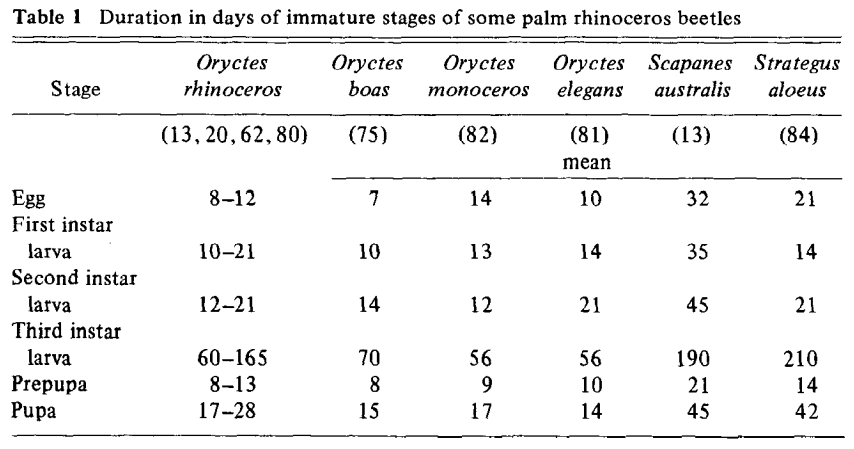

# Sources for Coconut Rhinoceros Beetle Model Parameters

## Life cycle

Bedford 1980:

## Life span and generation time

Gressitt 1953: "The total life span in Palau may range from 150 to about 270 days, and I assume the average under normal conditions to be about 200 days. The pre-incubation period is about 12 to 20 days. The period from the of an egg to first egg of the next generation may be as little as 115 days. Thus, given favorable conditions, more than 3 genertions my develop in one year."

## Fecundity

Gressitt 1953: "A female lays 70 to more than 100 eggs in its lifetime. Taking 90 as the average number of eggs laid by one female and assuming the sex ratio to be one female to one male, with an average life-cycle of 4 months to middle of egg-layng period for each female), the theoreticalfigure of 186,390 progeny per originalfemale during one year (16,995,293,890 by the end of two years) is obtained."

## Sex ratio

Gressitt 1953: "Of 282 specimens examined from palau and Samoa, 142 were males and 140 were females. This suggests a ratio of 1.014 males to one female."

## Flight distances

